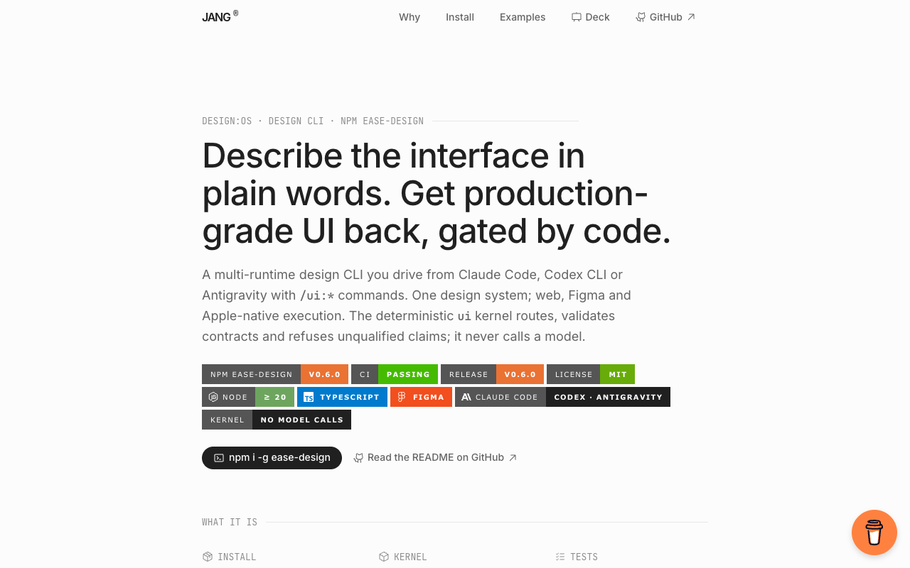
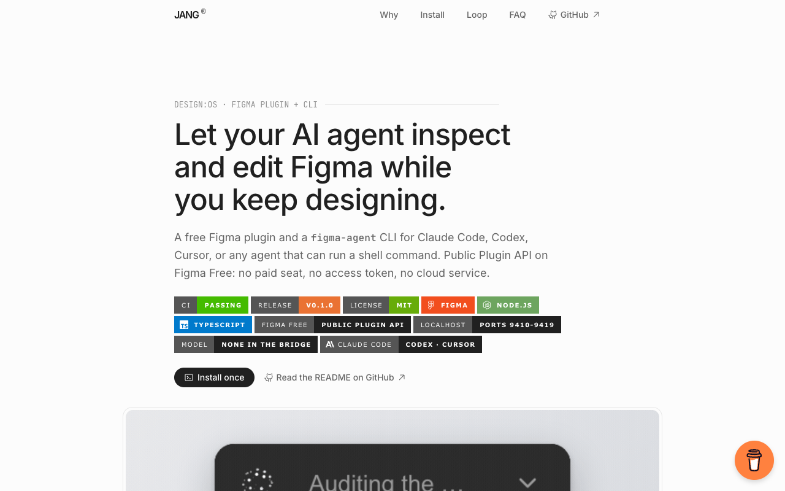
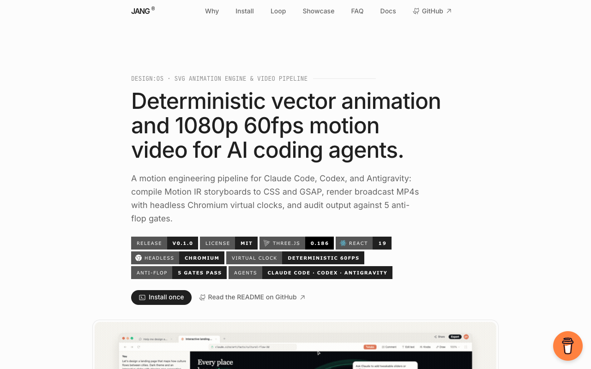
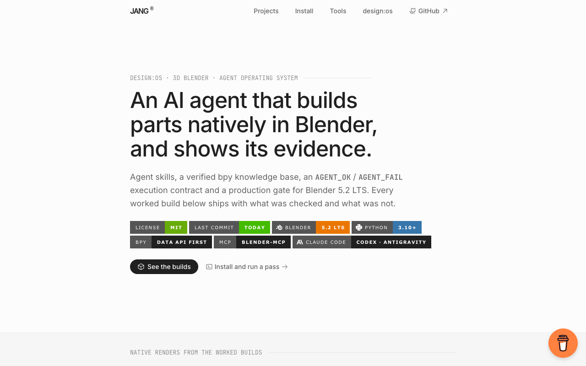
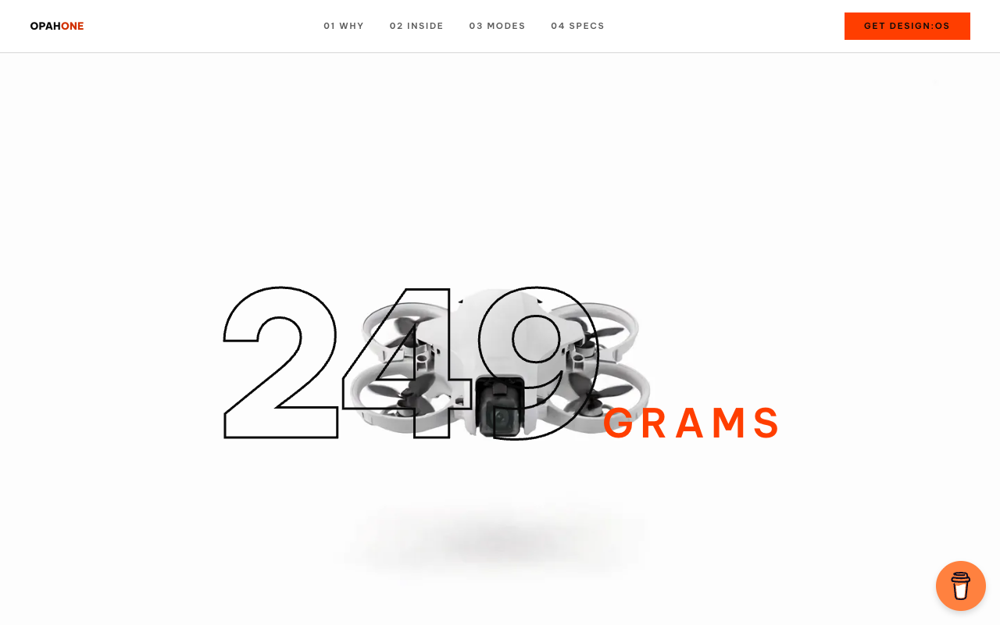

# design-os-github-page

> **Author-grade GitHub Pages marketing & documentation engine for builders and AI coding agents.**  
> Evolved from the 6 production repositories of the `design:os` ecosystem into a universal, zero-dependency engine.

[](https://github.com/jangtrinh/design-os-github-page/actions)
[](LICENSE)
[](https://jangtrinh.github.io/design-os-github-page/)
[](#)
[](#)

---

## What It Is

`design-os-github-page` transforms **any public GitHub repository** into an author-grade, fast-indexing, high-converting marketing and documentation site hosted for free on GitHub Pages.

- **Zero External Dependencies**: Powered by a standalone Python 3 standard library script. No `npm install`, no `cargo`, no pip packages.
- **The 9-Tier Information Architecture**: Replaces "AI slop" and walls of text with structured, credible technical storytelling.
- **Full Machine-Readability Pack**: Built-in Google SEO, XML Sitemap, `robots.txt`, `llms.txt` (GEO), and Schema.org `FAQPage` (AEO).
- **Built-in Monetization**: Native Buy Me a Coffee floating widget.
- **Ecosystem Cross-Sale**: Dedicated cross-promotional section connecting companion repositories.

---

## Quickstart

Scaffold an author-grade site in `./docs` in seconds:

```bash
# Clone the generator
git clone https://github.com/jangtrinh/design-os-github-page.git
cd design-os-github-page

# Scaffold for any repository
python3 scripts/scaffold-repo-pages.py \
  --owner <github-owner> \
  --repo <repo-name> \
  --name "<Display Name>" \
  --category "<Category / Ecosystem>" \
  --tagline "<Actionable Proposition Sentence>" \
  --desc "<160-char Meta Description for SEO/AEO>" \
  --accent "#2563eb" \
  --bmc "<buymeacoffee-id>" \
  --out-dir ./docs
```

### Generated Files

```text
docs/
├── index.html            # 9-tier author-grade landing page with Schema.org JSON-LD
├── _config.yml           # Jekyll configuration for GitHub Pages
├── _layouts/
│   └── default.html      # Canonical layout for Markdown deep-dive pages
├── assets/
│   └── site.css          # EaseUI design system token ladder (Inter, Mono, 0-chroma)
├── robots.txt            # RFC 9309 crawler permissions & sitemap declaration
├── sitemap.xml           # sitemaps.org XML 0.9 with dynamic lastmod
└── llms.txt              # llmstxt.org specification for AI search (ChatGPT, Perplexity)
```

---

## The 9-Tier Layout Hierarchy

| Tier | Section | Architectural Purpose |
| :--- | :--- | :--- |
| **1** | **Hero & 3-Second Rule** | Eyebrow category · Proposition H1 (`clamp(30px,4.6vw,48px)`) · Meta description lede · Badges row (height 28px) · Primary solid button + secondary text link · Uncropped capture stage |
| **2** | **Facts Register** | `<dl class="facts">`: Repository, Requires, Interface, Transport/Protocol, Telemetry policy, License |
| **3** | **Honest Comparison** | 4-row advantage register · Honest aside box (`div.aside`) noting where existing alternatives win |
| **4** | **Install Once** | 3–4 line non-interactive terminal block |
| **5** | **Safe Use & Loop** | 3 numbered safe steps (`--version`, `status --json`, `run --dry-run`) · 4-row practical loop register |
| **6** | **Deep Evidence / Demo** | Architecture diagram stage, 3D CAD viewer, or worked-builds responsive card grid |
| **7** | **AEO FAQ Engine** | 5 semantic `<details><summary>` Q&As matching Schema.org `FAQPage` word-for-word |
| **8** | **Ecosystem Section** | `<section id="ecosystem">`: Cross-sale links to author's companion repositories/tools |
| **9** | **Read Next & Footer** | 3–4 deep-dive documentation links · Minimal 3-tab footer (GitHub, License, Back to top) |

---

## Why This Tool, Compared with Alternatives

| Feature | `design-os-github-page` | Docusaurus / Nextra / Astro | Default GitHub Pages Themes |
| :--- | :--- | :--- | :--- |
| **Dependencies** | **0** (Python stdlib) | 1,000+ npm packages | Bundled Jekyll gems |
| **Build Time** | **< 100 ms** (instant) | 30–90 seconds | 10–30 seconds |
| **Layout Craft** | **9-Tier Author-Grade** | Generic doc shell | Dated 2014 blogs |
| **Machine-Readability** | **SEO + GEO (`llms.txt`) + AEO (`FAQPage`)** | Manual plugin setup | None |
| **Monetization & Ecosystem** | **Native BMC widget + cross-sale section** | Manual components | None |

---

## Live Case Studies (design:os Reference Suite)

The 6 production implementations of this architecture across different repository categories (each individually accessible and directly clickable):

| Preview | Repository | Category | Live Showcase & Documentation |
| :--- | :--- | :--- | :--- |
| [](https://jangtrinh.github.io/design-os/) | **[design-os](https://github.com/jangtrinh/design-os)** | CLI Tool | [Live Pages ↗](https://jangtrinh.github.io/design-os/) · Terminal verb registers & automated workflows |
| [](https://jangtrinh.github.io/design-os-figma-plugin/) | **[design-os-figma-plugin](https://github.com/jangtrinh/design-os-figma-plugin)** | Desktop Plugin | [Live Pages ↗](https://jangtrinh.github.io/design-os-figma-plugin/) · Live canvas bridge & bidirectional sync |
| [](https://jangtrinh.github.io/design-os-svg-animation/) | **[design-os-svg-animation](https://github.com/jangtrinh/design-os-svg-animation)** | Vector Engine | [Live Pages ↗](https://jangtrinh.github.io/design-os-svg-animation/) · Deterministic 1080p 60fps video generation |
| [](https://jangtrinh.github.io/design-os-3d-blender/) | **[design-os-3d-blender](https://github.com/jangtrinh/design-os-3d-blender)** | 3D / CAD | [Live Pages ↗](https://jangtrinh.github.io/design-os-3d-blender/) · Three.js CAD viewer & BOM catalog |
| [](https://jangtrinh.github.io/design-os-drone-showcase/) | **[design-os-drone-showcase](https://github.com/jangtrinh/design-os-drone-showcase)** | Hardware | [Live Pages ↗](https://jangtrinh.github.io/design-os-drone-showcase/) · 249g drone kinematics & teardown |
| [](https://jangtrinh.github.io/design-os-pedagogy/) | **[design-os-pedagogy](https://github.com/jangtrinh/design-os-pedagogy)** | Curriculum | [Live Pages ↗](https://jangtrinh.github.io/design-os-pedagogy/) · Agent Teacher curriculum tree & logs |

---

## License

Released under the permissive [MIT License](LICENSE). Free for commercial and personal open-source projects.
