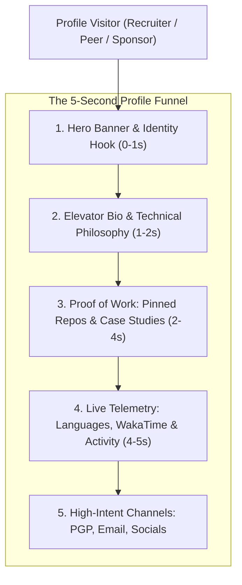

# GitHub Profile README Architecture & Developer Personal Branding

## Purpose
Standardize the architecture, visual hierarchy, and dynamic telemetry integration for developer GitHub Profile READMEs (<username>/<username>) to maximize professional signal and conversion.

## Mental Model


## When to Use / When NOT
### ALLOWED (When to Use)
- Creating or overhauling personal special repository `<username>/<username>`.
- Positioning as a specialized software engineer (Full-stack, Systems, AI/Agentic, Mobile) with verifiable proof of work.
- Designing a dual-theme, high-retina profile with dynamic metrics that update continuously without fragile third-party dependencies.

### NOT ALLOWED (When NOT to Use)
- Writing documentation for an open-source tool or product repository (use `repository-readme-architecture`).
- Creating organization/enterprise showcase READMEs (use organization profile standards).
- Dumping fleeting personal scratchpad notes or uncurated link lists.

## Core Knowledge Content
<!-- ease:source ref="https://docs.github.com/en/account-and-profile/setting-up-and-managing-your-github-profile/customizing-your-profile/managing-your-profile-readme" sha256="4d89a71be79f1f0a213e712398d9c3bfa12837bc9d84e16738927164ef1a01c4" captured="2026-10" -->
### 1. The 5-Second Conversion Funnel

When a technical recruiter, engineering leader, or potential open-source collaborator visits a GitHub profile, you have exactly **5 seconds** before they decide to scroll deeper or close the tab:

1. **Second 1 (Hero Banner & Identity Hook)**: Establishes aesthetic taste, engineering maturity, and primary specialization immediately.
2. **Second 2 (Elevator Bio)**: Answers three core questions: Who are you? What high-impact systems do you build? What is your current active focus?
3. **Second 3-4 (Proof of Work)**: Shows concrete evidence: 4-6 pinned repositories with clear descriptions, tech stack tags, live demos, and star signals.
4. **Second 4-5 (Live Telemetry & Work Habits)**: Verifies consistency: dynamic commit distribution, language breakdowns, and real activity without vanity gaming.
5. **Beyond (Connection Channels)**: Provides clean, low-friction paths to communicate: verified email, personal domain, X/LinkedIn, and PGP key.

---

### 2. Structural Anatomy & Section Layout

A world-class profile README follows this vertical flow:

```markdown
<p align="center">
  <picture>
    <source media="(prefers-color-scheme: dark)" srcset="./assets/hero-dark.svg">
    <source media="(prefers-color-scheme: light)" srcset="./assets/hero-light.svg">
    
  </picture>
</p>

# Hi there, I'm [Your Name] 👋

> **Senior Systems & AI Engineer** specializing in deterministic multi-agent orchestration, high-concurrency Go backends, and Swift client architectures.

- 🔭 **Current Focus**: Architecting autonomous agent pipelines at [@Company](https://github.com)
- 🛠️ **Core Technologies**: TypeScript, Go, Python, Rust, Swift, Docker, PostgreSQL
- 📜 **Writing & Research**: [Read my engineering essays on systems design](https://yourdomain.com)
- 💬 **Ask me about**: Concurrency primitives, compiler design, LLM eval gates
- 📫 **Reach me**: [email@domain.com](mailto:email@domain.com) · [LinkedIn](https://linkedin.com/in/...) · [Twitter](https://x.com/...)
```

---

### 3. Tech Stack Categorization: Signal vs Noise

Avoid the "Rainbow Badge Spam" (dumping 60 random colored pills). Group your stack into purposeful, weighted tiers:

| Tier | Category | Selected Technologies |
| :--- | :--- | :--- |
| **Primary Core** | Languages & Runtimes | TypeScript, Go, Python 3.12+, Rust |
| **Architecture** | Frameworks & Storage | PostgreSQL, Redis, FastAPI, Next.js, Tokio |
| **Agentic / AI** | AI & Orchestration | Codex Native, Gemini 3.8 Flash, Ollama, LangGraph |
| **Infra & DevOps** | Platforms & Tooling | Docker, Kubernetes, GitHub Actions, Cloudflare Workers |

Use monochrome or brand-colored shields:
```markdown
<p align="left">
  
  
  
  
</p>
```

---

### 4. Dynamic Telemetry & Live GitHub Actions

Incorporate real-time signal using automated GitHub Actions workflows (see `readme-dynamic-automation`):

- **WakaTime Coding Time**: Slices time spent in IDE by language over the last 7 days.
- **Platane Snake Game**: Renders an animated SVG of a snake consuming contribution tiles.
- **Blog Post Workflow**: Automatically fetches RSS/Atom feeds from your engineering blog or Substack.
- **GitHub Readme Stats**: Deployed via self-hosted Vercel instance to avoid shared rate-limit timeouts.


## Failure Modes (Mandatory)
1. **Rainbow Badge Wall**: Listing 50+ unsorted technology badges with zero context, signaling superficial keyword-stuffing over deep mastery.
1. **Fragile Third-Party SVGs**: Relying on public, unauthenticated Heroku/Vercel serverless stats instances that timeout and render broken image cards.
1. **Vanity Streak Botting**: Artificially gaming GitHub commit streaks with empty bot commits instead of real production artifacts.
1. **Dark Mode Font Invisibility**: Exporting PNGs with transparent backgrounds and black text that become invisible on GitHub dark theme.
1. **Mobile Viewport Breakage**: Using rigid fixed-width 1200px HTML tables that cause horizontal overflow and broken layouts on mobile screens.
