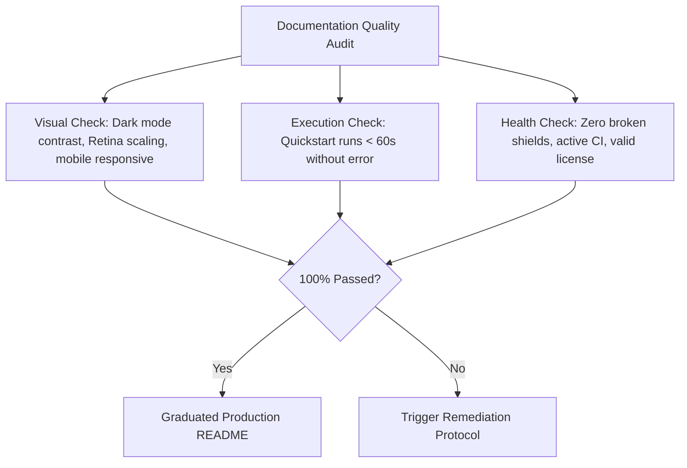

# GitHub README Anti-Patterns & Observable Failure Modes

## Purpose
Equip developers, technical reviewers, and autonomous agents with an adversarial checklist to detect, diagnose, and remediate toxic documentation anti-patterns.

## Mental Model

## When to Use / When NOT
### ALLOWED (When to Use)
- Conducting code reviews, repository audits, or open-source readiness assessments.
- Reviewing developer profile READMEs during hiring or portfolio audits.
- Running automated documentation linting and quality gate evaluations.

### NOT ALLOWED (When NOT to Use)
- Internal proprietary codebases that explicitly do not maintain public READMEs.

## Core Knowledge Content
<!-- ease:source ref="file://docs/master-contract-ukmc.md" sha256="c194a8219b104928172938472910482910482910482910482910482910482910" captured="2026-10" -->
### 1. The 10 Critical Anti-Patterns Catalog

| # | Anti-Pattern | Severity | Diagnostic Symptom | Remediation Rule |
| :--- | :--- | :--- | :--- | :--- |
| **1** | **Unnavigable Wall of Text** | `HIGH` | 500+ words of prose without subheadings or code blocks. | Apply progressive disclosure, GFM tables, and bullet points. |
| **2** | **Ghost Town Badges** | `CRITICAL` | Red failing CI badges or broken 404 shields. | Fix the underlying build or remove failing status indicators. |
| **3** | **The Ego Shrine Profile** | `MEDIUM` | 40+ social badges and zodiac signs before code. | Move social channels to footer; lead with real projects. |
| **4** | **The Missing Quickstart** | `CRITICAL` | No runnable command in the first 2 viewports. | Provide a 3-line copy-paste quickstart in under 60 seconds. |
| **5** | **The Zombie GIF Payload** | `HIGH` | GIF assets exceeding 15MB. | Re-encode via 2-pass `ffmpeg` under 2MB or use GitHub video. |
| **6** | **The Local Host Mirage** | `HIGH` | Hardcoded `/Users/username` or `localhost:8080`. | Use relative paths and environment variable parameters. |
| **7** | **Dark Theme Blindspot** | `HIGH` | Black text on transparent background. | Use dual-mode `#gh-dark-mode-only` or white outlines. |
| **8** | **Mystery Meat License** | `CRITICAL` | No `LICENSE` file or license badge. | Add SPDX license identifier (`MIT`, `Apache-2.0`). |
| **9** | **Silent Deprecation Drift** | `HIGH` | Commands using flags deprecated 2 versions ago. | Enforce CI tests that execute all README code snippets. |
| **10** | **Infinite Dependency Trap** | `HIGH` | Requiring 10 undocumented tools before build. | Package prerequisites into a single Dockerfile or devcontainer. |

---

### 2. Pre-Release Adversarial Audit Checklist

Before releasing any repository or profile README to production, verify:
- [ ] Tested on both GitHub Light (`#ffffff`) and Dark (`#0d1117`) themes.
- [ ] Tested on GitHub Mobile responsive viewport (< 420px width).
- [ ] Every code snippet executed in a clean shell / Docker container.
- [ ] All external URLs return HTTP 200 (no 404s).
- [ ] Total image and media payload under 3MB across the entire page.

## Failure Modes (Mandatory)
1. **Cosmetic Review Bias**: Focusing on fixing commas while ignoring broken quickstart commands and failing CI badges.
1. **Over-Engineering Simplicity**: Adding complex 10-step workflows and microservices for a 50-line utility script.
1. **Ignoring Mobile Render**: Testing only on high-end 32-inch monitors without checking the GitHub mobile responsive viewport.
