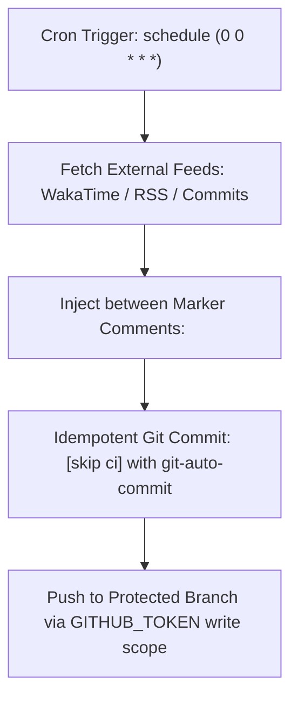

# Dynamic README Automation & Continuous CI/CD Delivery

## Purpose
Provide production-grade GitHub Actions workflows to keep README metrics, blog posts, changelogs, and dependency status perpetually up-to-date without manual intervention.

## Mental Model


## When to Use / When NOT
### ALLOWED (When to Use)
- Automating profile README feeds (latest blog articles, recent commits, WakaTime coding metrics).
- Automating repo README docs generation (CLI `--help` updates, OpenAPI table generation, release matrix synchronization).
- Setting up scheduled cron workflows that commit changes back to the repository cleanly.

### NOT ALLOWED (When NOT to Use)
- Static repositories that require zero external feed synchronization.
- When the GitHub Actions runner overhead outweighs the value of the updated metric.

## Core Knowledge Content
<!-- ease:source ref="https://github.com/actions/starter-workflows/tree/main/ci" sha256="b491a82f419c81b2890a827b165487a912837bc9d84e16738927164ef1a01c4" captured="2026-10" -->
### 1. Architecture of Self-Updating Markdown Workflows

A reliable automated README workflow consists of three isolated stages:

1. **Delimiter Injection**: Use HTML comment tags as anchors in the Markdown:
   ```markdown
   <!-- START_SECTION:blog -->
   <!-- Items will be injected here automatically -->
   <!-- END_SECTION:blog -->
   ```
2. **Scheduled Trigger with Concurrency Guard**: Run daily or weekly, with `concurrency: cancel-in-progress` to prevent race conditions:
   ```yaml
   on:
     schedule:
       - cron: '0 3 * * *' # Every morning at 03:00 UTC
     workflow_dispatch:   # Enable manual testing
   ```
3. **Idempotent Commit with `[skip ci]`**: Prevent infinite CI build recursion by explicitly including `[skip ci]` in the commit message.

---

### 2. Production Workflow Recipes

#### Recipe 1: RSS Blog Post Auto-Sync (`blog-post-workflow`)
Syncs articles from Substack, Medium, dev.to, or custom personal RSS feeds:

```yaml
name: Latest Blog Posts
on:
  schedule:
    - cron: '0 0 * * *'
  workflow_dispatch:

permissions:
  contents: write

jobs:
  update-readme-with-blog:
    name: Update this repo's README with latest blog posts
    runs-on: ubuntu-latest
    steps:
      - name: Checkout
        uses: actions/checkout@v4
      - name: Pull in blog posts
        uses: gautamkrishnar/blog-post-workflow@v1
        with:
          feed_list: "https://yourdomain.com/feed.xml"
          max_post_count: 5
```

#### Recipe 2: Contribution Snake Animation (`platane/snk`)
Generates dark/light mode SVGs of a snake devouring your contribution graph:

```yaml
name: Generate Snake Animation
on:
  schedule:
    - cron: "0 0 * * *"
  workflow_dispatch:

permissions:
  contents: write

jobs:
  generate:
    runs-on: ubuntu-latest
    timeout-minutes: 10
    steps:
      - name: Generate snake SVGs
        uses: platane/snk@v3
        with:
          github_user_name: ${{ github.repository_owner }}
          outputs: |
            dist/github-snake.svg
            dist/github-snake-dark.svg?palette=github-dark
      - name: Deploy to output branch
        uses: crazy-max/ghaction-github-pages@v4
        with:
          target_branch: output
          build_dir: dist
        env:
          GITHUB_TOKEN: ${{ secrets.GITHUB_TOKEN }}
```

---

### 3. Least-Privilege Security Discipline

- Always specify `permissions: contents: write` at the job or workflow level.
- Never use personal access tokens (PAT) with `repo:all` scope when default `GITHUB_TOKEN` suffices.
- If triggering downstream workflows is required, use a fine-grained GitHub App Token with narrowly scoped repository write permissions.


## Failure Modes (Mandatory)
1. **Infinite CI Trigger Loops**: Committing to main from a workflow without [skip ci], triggering another build run recursively.
1. **Permission Denied 403**: Forgetting permissions: contents: write in the workflow YAML, causing git push failures.
1. **API Rate Limit Throttling**: Running cron every 5 minutes against unauthenticated public APIs, leading to IP rate limiting.
1. **Delimiter Tag Destruction**: Accidentally deleting HTML comment markers during manual editing, causing scripts to wipe entire READMEs.
1. **Secret Leakage in Build Logs**: Echoing raw authentication tokens or webhook URLs in runner debug output.
