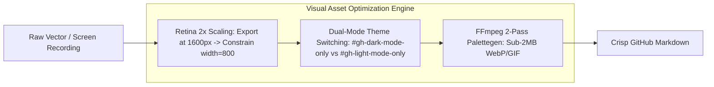

# High-Fidelity Visual Craft & Asset Engineering for GitHub READMEs

## Purpose
Define technical asset engineering standards for GitHub READMEs to achieve Retina clarity, seamless light/dark mode adaptation, and instant mobile loading under 3MB total payload.

## Mental Model


## When to Use / When NOT
### ALLOWED (When to Use)
- Creating hero banners, system diagrams, architecture flowcharts, or UI screencasts for GitHub READMEs.
- Engineering assets that adapt dynamically to GitHub Dark (`#0d1117`) and Light (`#ffffff`) theme modes.
- Compressing terminal screencasts and UI recordings to eliminate lag, bandwidth bloat, and mobile OOM crashes.

### NOT ALLOWED (When NOT to Use)
- General CSS web styling or full web application asset pipelines.
- Text-only documentation where visual diagrams add zero explanatory value.

## Core Knowledge Content
<!-- ease:source ref="https://docs.github.com/en/get-started/writing-on-github/getting-started-with-writing-and-formatting-on-github/basic-writing-and-formatting-syntax#specifying-the-theme-an-image-is-shown-to" sha256="e81878b3f2711019d3648a829104018cae834612984920194829104018239019" captured="2026-10" -->
### 1. Native GitHub Light/Dark Theme Switching

GitHub supports two primary methods for serving adaptive assets based on user color scheme:

#### Method A: URL Fragment Identifiers (Recommended for Markdown images)
Append `#gh-dark-mode-only` or `#gh-light-mode-only` to the image URI:

```markdown
<p align="center">
  
  
</p>
```

#### Method B: HTML `<picture>` Element (Recommended for multi-format art direction)
```html
<p align="center">
  <picture>
    <source media="(prefers-color-scheme: dark)" srcset="./assets/diagram-dark.svg">
    <source media="(prefers-color-scheme: light)" srcset="./assets/diagram-light.svg">
    
  </picture>
</p>
```

---

### 2. Retina 2x Scaling Discipline

Displaying a 1x raster image (e.g., 800×400px image displayed at 800px width) produces blurry text and fuzzy lines on Retina MacBooks and modern 4K monitors:

- **Rule**: Export bitmap assets at **200% physical pixel dimension** (e.g., 1600×800px for a banner meant to display at 800px width).
- **Enforcement**: Always hardcode the intended display width in Markdown via HTML image tags:
  ```html
  
  ```
- **SVGs**: Use vector SVGs for all diagrams and charts whenever possible to gain infinite resolution at minimal kilobyte cost.

---

### 3. Screencast & Video Compression: The Sub-2MB Rule

Uncompressed animated GIFs (often 20MB–50MB) cause severe page latency and frequently crash GitHub's mobile iOS/Android client:

#### The Two-Pass `ffmpeg` Palettegen Pipeline
Use this two-pass command to turn a `.mov` or `.mp4` screen capture into a razor-sharp, 15fps GIF under 2MB:

```bash
# Pass 1: Generate optimal 256-color palette
ffmpeg -y -i recording.mov -vf "fps=15,scale=800:-1:flags=lanczos,palettegen" palette.png

# Pass 2: Render GIF using palette with Bayer dithering
ffmpeg -i recording.mov -i palette.png -filter_complex "fps=15,scale=800:-1:flags=lanczos[x];[x][1:v]paletteuse=dither=bayer:bayer_scale=3" demo.gif
```

#### GitHub Native Video Hosting
Alternatively, drag-and-drop an `.mp4` into any GitHub Issue or PR editor, copy the generated `https://github.com/user-attachments/assets/...` link, and paste it directly into your README. GitHub will render a native HTML5 video player with mute, seek, and loop controls.


## Failure Modes (Mandatory)
1. **Dark Theme Text Obliteration**: Exporting transparent PNGs with black text, rendering text completely invisible in GitHub dark mode.
1. **Mobile OOM Crashes**: Inlining multiple 25MB+ uncompressed GIFs that exhaust RAM and crash GitHub mobile app.
1. **Blurry 1x Raster Distortion**: Displaying unscaled 72dpi raster screenshots that look jagged on Retina displays.
1. **Hotlinking Fragile External CDNs**: Linking images from temporary hosting sites that expire or get blocked by ad-blockers.
1. **Oversized Hero Banners**: Using 1200px tall banners that push all meaningful code and quickstart content far below the fold.
