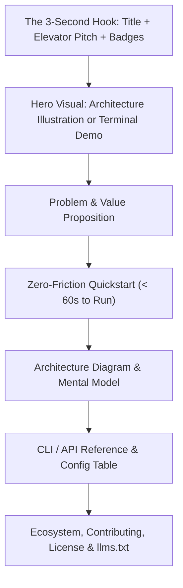
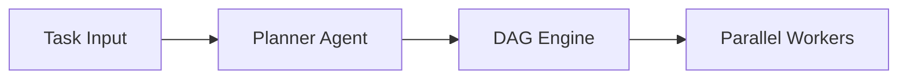

# Repository README Architecture & Open-Source Product Blueprint

## Purpose
Guide developers and AI coding agents in structuring repository READMEs that immediately communicate value, reduce time-to-first-run under 60 seconds, and facilitate AI agent indexing.

## Mental Model


## When to Use / When NOT
### ALLOWED (When to Use)
- Writing or updating the root README.md for an open-source library, CLI tool, framework, or SaaS project.
- Preparing a repository for public release, open-source security audits, or Hacker News / Product Hunt launches.
- Optimizing documentation for consumption by LLM coding agents via `llms.txt` and machine schemas.

### NOT ALLOWED (When NOT to Use)
- Personal profile READMEs (use `profile-readme-architecture`).
- Ephemeral branch notes, internal scratchpads, or raw commit logs.

## Core Knowledge Content
<!-- ease:source ref="https://opensource.guide/starting-a-project/#writing-a-readme" sha256="9a82b7c61e05d2f4418a09e3e782bc419d20c541793818e9a1120f283d7120a1" captured="2026-10" -->
### 1. The 3-Second Hook Rule

Every open-source or commercial repository README must communicate its entire value proposition before the reader scrolls below the fold:

1. **Title & Logo**: Bold, clean project name with a self-describing 1-word tagline.
2. **Badge Strip**: Maximum 5-6 status badges in an exact hierarchy:
   - Build / CI Status (`passing`)
   - Release Version / NPM / PyPI
   - License (`MIT` / `Apache-2.0`)
   - Test Coverage (`95%+`)
   - Documentation / Live Demo
3. **Elevator Pitch**: A single blockquote (`> ...`) summarizing what the project does, whom it is for, and its primary differentiator.
4. **Hero Visual**: A technical architecture diagram, terminal GIF recording, or seated mechanical asset centered at Retina 2x resolution.

---

### 2. Standard 12-Section Architecture Blueprint

```markdown
# Project Name (`package-name`)

[](https://github.com/org/repo/actions)
[](https://opensource.org/licenses/MIT)
[](https://pypi.org/project/package-name)

> **Universal High-Throughput Task Orchestration Engine for AI Coding Agents.**
> Deterministic DAG scheduling, sub-millisecond dispatch, and formal stopping gates.

<p align="center">
  
</p>

---

## 🌟 The Problem & Solution
- **The Problem**: Traditional pipelines fail silently when agents hit token limits.
- **The Solution**: Discrete file-backed ledgers and formal epistemic gates.

## ⚡ Quickstart (< 60 seconds)
```bash
# 1. Install via package manager
pip install package-name

# 2. Initialize project configuration
package-name init

# 3. Run validation test
package-name run --verify
```

## 🏛️ Architecture & Data Flow


## 🛠️ CLI / API Reference
| Flag | Type | Default | Description |
| :--- | :--- | :--- | :--- |
| `--config` | `string` | `./config.json` | Path to orchestrator config |
| `--concurrency` | `int` | `4` | Max parallel worker threads |
| `--dry-run` | `bool` | `false` | Simulate execution without writes |

## 🧪 Testing
```bash
pytest tests/ -v --cov=package_name
```

## 📜 License
MIT License. See [LICENSE](./LICENSE) for details.
```

---

### 3. Agent & Machine Discoverability (AEO)

Modern software repositories are read as much by AI coding agents (Claude Code, Codex, Antigravity) as by humans:
- Provide an `llms.txt` file at repo root following the [llmstxt.org](https://llmstxt.org) standard.
- Include machine routing tags in frontmatter.
- Maintain an `AGENTS.md` specifying execution boundaries and testing expectations.


## Failure Modes (Mandatory)
1. **Zero-Context Prose Walls**: Writing long philosophical preambles before showing what the library does or how to install it.
1. **Missing Prerequisites Trap**: Documenting 'npm start' without specifying Node.js version requirements or required system packages.
1. **Ghost Badges**: Embedding shields.io badges pointing to broken endpoints, deprecated services, or failing build statuses.
1. **Undocumented Environment Variables**: Requiring hidden .env files or secret tokens without documenting them in the README.
1. **Missing or Ambiguous License**: Neglecting to include an SPDX-compliant LICENSE file, blocking enterprise legal compliance.
