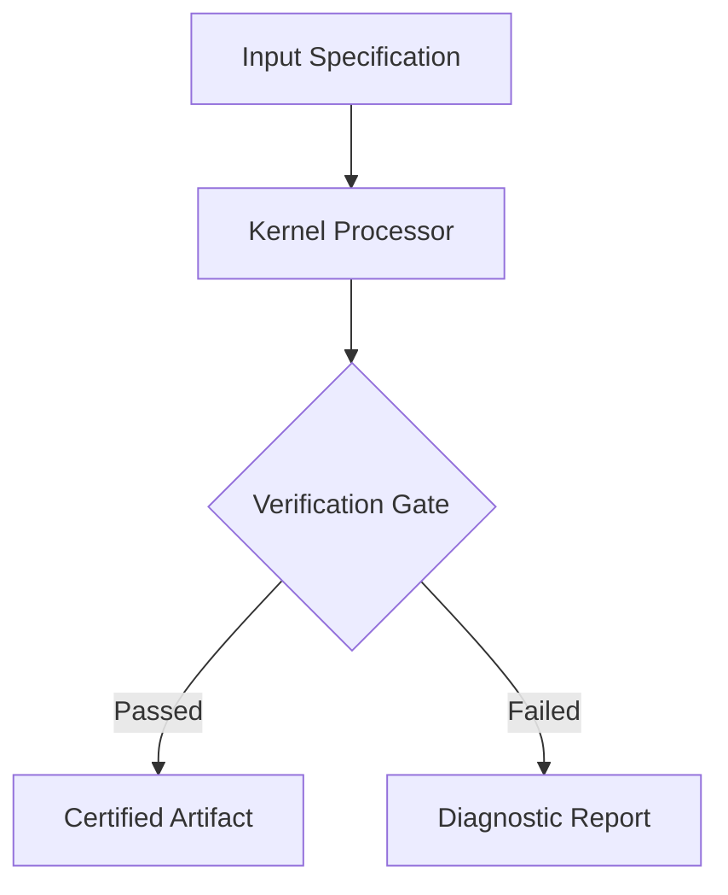

# {{REPO_NAME}}

> **{{ONE_LINE_VALUE_PROPOSITION}}**  
> {{SECONDARY_VALUE_STATEMENT}}

[]({{CI_RUN_URL}})
[]({{LICENSE_URL}})
[]({{DOCS_URL}})
[]({{DOCS_URL}})

<p align="center">
  
</p>

---

## 1. What It Solves

{{PARAGRAPH_PROBLEM_AND_SOLUTION}}

- **{{CAPABILITY_1_TITLE}}**: {{CAPABILITY_1_DETAIL}}
- **{{CAPABILITY_2_TITLE}}**: {{CAPABILITY_2_DETAIL}}
- **{{CAPABILITY_3_TITLE}}**: {{CAPABILITY_3_DETAIL}}

---

## 2. Technical Register

| Parameter | Specification | Verification Standard |
| :--- | :--- | :--- |
| **Language Runtime** | {{RUNTIME_VERSION}} | {{RUNTIME_TEST}} |
| **Architecture** | {{ARCHITECTURE_PATTERN}} | {{ARCH_TEST}} |
| **Verification Gate** | {{VERIFICATION_GATES}} | {{GATES_STATUS}} |
| **Telemetry Policy** | Zero External Network Calls | Source Code Audited |
| **License** | {{LICENSE_NAME}} | OSI-Compliant |

---

## 3. Quickstart & Installation

```bash
# Clone the repository
git clone https://github.com/{{GITHUB_OWNER}}/{{REPO_NAME}}.git
cd {{REPO_NAME}}

# Execute one-shot verification setup
{{INSTALL_COMMAND}}
```

### Basic Usage

```bash
{{USAGE_EXAMPLE_COMMAND}}
```

---

## 4. Architecture & Data Flow



---

## 5. Verification & Testing

```bash
# Run unit tests
{{TEST_COMMAND}}

# Run lint and format checks
{{LINT_COMMAND}}
```

---

## 6. Ecosystem & Integration

Part of the **`{{ECOSYSTEM_NAME}}`** toolchain:

| Companion Tool | Domain | Integration Point |
| :--- | :--- | :--- |
| [**`{{TOOL_1_NAME}}`**]({{TOOL_1_URL}}) | {{TOOL_1_DOMAIN}} | {{TOOL_1_ROLE}} |
| [**`{{TOOL_2_NAME}}`**]({{TOOL_2_URL}}) | {{TOOL_2_DOMAIN}} | {{TOOL_2_ROLE}} |

---

## 7. License

{{LICENSE_NAME}} — see [LICENSE](LICENSE) for details.
